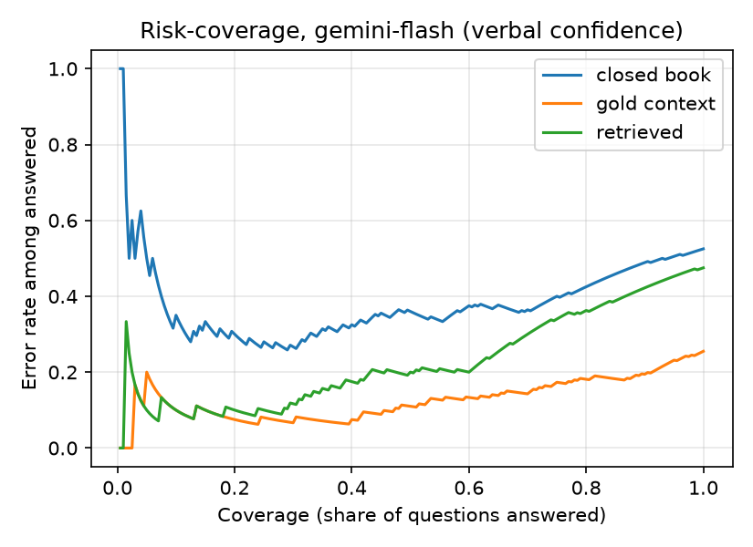
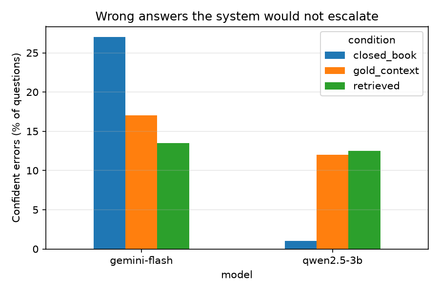

# Answer or escalate? Selective answering for LLM assistants on biomedical questions

**Muhammad Kashif** · [Portfolio](https://kashif-ai-portfolio.netlify.app) · [LinkedIn](https://www.linkedin.com/in/muhammad-kashif-928655142)

## Motivation

I build and run PawBot, the LLM assistant inside [FurMyLife](https://furmylife.com). It answers pet owners' health questions using each pet's records, and it is supposed to tell the owner to see a vet when it is unsure. In production I can only judge that behaviour from anecdotes. This project asks the same question in a setting where the right answers are known, so it can be measured:

> When a language model is about to answer a health question, can it tell when it is likely to be wrong, and hand the question over to a human instead?

A system that answers 70% of questions and escalates the rest can be safer than one that answers everything, but only if its confidence actually separates right answers from wrong ones.

## Research questions

- **RQ1.** How much does giving the model evidence improve accuracy, compared with answering from memory? And how much of that gain survives when the evidence comes from a search step that can return the wrong study?
- **RQ2.** How well calibrated is the model's stated confidence? Is it more useful than a simple consistency signal (asking the same question several times and checking agreement)?
- **RQ3.** If the system escalates its least confident answers to a human, what share of its errors does it catch? How many confident errors remain?

## Data

[PubMedQA](https://pubmedqa.github.io/) (Jin et al., 2019), the PQA-L subset: 1,000 research questions written from PubMed article titles. Each comes with the article's abstract (minus its conclusion), split into labelled sections, and an expert yes / no / maybe answer. The label distribution is 55% yes, 34% no, 11% maybe. By default I use a stratified sample of 200 questions (seed 13), which keeps the same mix.

## Method

**Three evidence conditions**

| Condition | What the model sees |
|---|---|
| `closed_book` | The question only |
| `gold_context` | The question plus its own abstract, with section labels (BACKGROUND, METHODS, RESULTS, ...) |
| `retrieved` | The question plus the top 3 passages found by TF-IDF search over all 1,000 abstracts; these may come from other studies |

`gold_context` stands in for an assistant with perfect records. `retrieved` stands in for a realistic one.

**Confidence signals**

- *Verbal:* the model is asked for JSON `{"answer": ..., "confidence": 0-100}` at temperature 0.
- *Consistency:* the same prompt is sampled 4 more times at temperature 0.7; the signal is the share of samples that agree with the temperature-0 answer (Wang et al., 2023).
- *Combined:* the mean of the two.

Replies that cannot be parsed get confidence 0, so the system would escalate them. Their rate is reported separately.

**Escalation rule.** Answer if confidence ≥ τ, otherwise escalate. Rather than fixing one τ, I report the full risk-coverage curve (Geifman & El-Yaniv, 2017).

**Metrics**

- Accuracy, with a 95% bootstrap confidence interval (1,000 resamples).
- *Confident error rate:* share of all questions answered wrongly with confidence ≥ 0.8. These are the errors the system would not escalate.
- Expected calibration error, ECE (Guo et al., 2017), 10 equal-width bins.
- AURC, the area under the risk-coverage curve (lower is better), with a bootstrap CI.
- *Errors caught at k%:* escalate the k% least confident questions and report what share of all errors they contain. Random escalation would catch k%.

**Models.** Gemini 3.1 Flash Lite (`gemini-3.1-flash-lite`) through the Google AI Studio API, and Qwen 2.5 3B (`qwen2.5:3b`), a small open model run locally on CPU with Ollama. This pairs a hosted model with one that can run on an ordinary laptop. Any other model can be added in `config.yaml`.

## Results

200 questions per model and condition, 1,200 in total, with no unparsed replies. The full tables are in [`results/RESULTS.md`](results/RESULTS.md), the figures in [`results/figures/`](results/figures/) and every reply in `results/raw/`.

| Model | Condition | Accuracy % | 95% CI | Confident errors % | ECE (verbal) | AURC (verbal) | Errors caught @20% (verbal / consistency) |
|---|---|---|---|---|---|---|---|
| Gemini 3.1 Flash Lite | closed_book | 47.5 | [40.5, 54.5] | 27.0 | 0.351 | 0.384 | 35.2 / 24.8 |
| Gemini 3.1 Flash Lite | gold_context | **74.5** | [68.5, 80.5] | 17.0 | **0.136** | **0.128** | **47.1** / 29.4 |
| Gemini 3.1 Flash Lite | retrieved | 52.5 | [45.5, 59.0] | 13.5 | 0.239 | 0.230 | 40.0 / 26.3 |
| Qwen 2.5 3B | closed_book | 11.0 | [7.0, 15.5] | 1.0 | 0.463 | 0.898 | 21.3 / 20.8 |
| Qwen 2.5 3B | gold_context | 38.5 | [32.5, 45.5] | 12.0 | 0.345 | 0.388 | 29.3 / 22.8 |
| Qwen 2.5 3B | retrieved | 31.5 | [25.0, 37.5] | 12.5 | 0.377 | 0.493 | 27.0 / 21.9 |

Confident errors are wrong answers given with confidence ≥ 80, as a share of all questions. Random escalation catches 20% of errors at 20%.





**RQ1: evidence.**
- With its own abstract, Gemini's accuracy rose from 47.5% to 74.5%; the confidence intervals do not overlap.
- With retrieved passages it reached only 52.5%, although the right study was among the three passages for 97% of questions. The search step did not fail; the model reacted to *partial* evidence by hedging.
  - With only one passage from the right study, Gemini answered *maybe* 69% of the time and was right 24% of the time. With all three, it said *maybe* 25% of the time and was right 70% of the time.
  - Of the 54 questions Gemini got right with the full abstract but wrong with retrieved passages, 48 became *maybe*.
- For an assistant, how complete the evidence is matters as much as whether the right document is found.

**RQ2: confidence.**
- Gemini's stated confidence is clearly overconfident without evidence: ECE is 0.35 closed-book and 0.14 with the abstract. Evidence makes the numbers more honest as well as more accurate.
- Stated confidence is coarse. Almost all answers sit at 85, 90 or 95, which is why the curves are step-shaped.
- The consistency signal was weaker than stated confidence in every setting. All four extra samples agreed with the first answer for 84–100% of questions, and for 80–99% of the wrong ones, so agreement carried little information. Combining the two signals left AURC almost unchanged and caught fewer errors than stated confidence alone.

**RQ3: escalation.**
- With the full abstract, escalating Gemini's 20% least confident answers caught 47% of its errors, more than twice the rate of random escalation. Answering only the most confident half cut the error rate from 25.5% to 11%.
- 17% of all questions remained confident errors, which escalation by confidence would never catch.
- Retrieved evidence produced the fewest confident errors (13.5%), at the cost of accuracy. Hedging turned errors into *maybe* answers rather than confident mistakes.
- Qwen 2.5 3B is a warning about reading these numbers in isolation. Closed-book it answered *maybe* to 198 of 200 questions, so it was almost never confidently wrong (1%) but almost never useful (11% accuracy). *Maybe* worked as a hidden way of not answering. Its confidence and consistency signals were barely better than random (21–29% of errors caught at 20%).

### Error analysis

I read the ten highest-confidence errors for each model and condition (60 in total, [`results/error_samples.md`](results/error_samples.md)) against the abstract and conclusion, and sorted them into:

1. **Maybe confusion:** the label is *maybe* and the model committed to yes/no, or the reverse.
2. **Wrong evidence:** retrieval returned a different study and the model trusted it.
3. **Misread evidence:** the right evidence was present but the model misread direction, subgroup or significance.
4. **Label disagreement:** on reflection the model's answer is defensible and the label is debatable.
5. **Plausible prior** (closed-book only): with no evidence, the model gave the generally expected answer, but this study found the opposite.

| Category | Gemini closed | Gemini gold | Gemini retrieved | Qwen closed | Qwen gold | Qwen retrieved | Total |
|---|---|---|---|---|---|---|---|
| Maybe confusion | 2 | 5 | 3 | 8 | 5 | 3 | 26 |
| Label disagreement | 2 | 4 | 3 | 0 | 2 | 2 | 13 |
| Misread evidence | 0 | 1 | 4 | 0 | 3 | 3 | 11 |
| Plausible prior | 6 | 0 | 0 | 2 | 0 | 0 | 8 |
| Wrong evidence | 0 | 0 | 0 | 0 | 0 | 2 | 2 |

- *Maybe* is the largest source of confident errors. The models rarely give *maybe* when the label is *maybe*, and they give it often when the label is yes or no.
- Wrong evidence was rare, consistent with the 97% retrieval hit rate.
- About one in five sampled errors is arguably a labelling issue rather than a model error, so the accuracy figures above are a lower bound.

Two examples:

- *Should temperature be monitored during kidney allograft preservation?* (20538207, label *no*). Closed-book, Gemini answered *yes* at 100%: monitoring sounds like good practice. With retrieved passages, all three from the right study, it still answered *yes* at 90%. The study shows that the new storage can keeps the temperature stable, and concludes that monitoring is therefore unnecessary. The model read "temperature matters" instead of the study's actual argument. This is a confident error that no escalation threshold would catch.
- *Does self-efficacy mediate the relationship between transformational leadership and healthcare workers' sleep quality?* (19694846, label *maybe*). Both models answered *no* at 100% in every evidence condition. The results state plainly that the relationship "was not mediated by employees' self-efficacy", so *no* is the more defensible answer. The *maybe* label probably reflects the authors' call for more research. Cases like this inflate the measured error rate and the confident-error count.

## Limitations

- Yes/no/maybe questions are much narrower than free-text health advice. "Wrong" is easy to define here, which is exactly why they are a useful first step, but the results do not transfer directly to open-ended answers.
- PubMedQA questions come from article titles, so TF-IDF retrieval finds the right abstract easily (97% top-3 hit rate on the sample). Retrieval works on passages, though, so the model often sees only part of the right abstract. That, not the wrong study, explains most of the gap between `gold_context` and `retrieved`. A harder retrieval setting would add genuinely wrong evidence.
- The error analysis is one reader's judgement on 60 errors, without a second annotator.
- The consistency signal used 4 samples at temperature 0.7. More samples or a higher temperature might make it more informative.
- Stated confidence often clusters on a few values (80, 90, 95). Ties make the curves step-shaped.
- 200 questions give wide confidence intervals for small differences. The bootstrap CIs show where differences are and are not meaningful.
- Closed models change over time; results are tied to the model versions in `results/raw/`.

## Next steps

- Free-text answers judged against the conclusion section, to move closer to a real assistant.
- Learned escalation: a small classifier over confidence, consistency and retrieval score.
- Harder retrieval (question paraphrases, a larger corpus), to study how evidence quality drives confident errors.

## How to run

Requires Python 3.10+.

```bash
python -m venv .venv
.venv\Scripts\activate            # Windows (on macOS/Linux: source .venv/bin/activate)
pip install -r requirements.txt

copy .env.example .env            # then add your GEMINI_API_KEY
ollama pull qwen2.5:3b            # optional, for the open model

python -m pytest                                 # offline tests
python -m escalate.run --model gemini-flash --limit 5   # quick check
python -m escalate.run                           # full run (resumes if interrupted)
python -m escalate.report                        # tables, figures, error sample
```

All settings (sample size, number of consistency samples, models) are in `config.yaml`. Raw model replies are stored in `results/raw/*.jsonl`, one line per question, so every number in the report can be traced back to a reply.

## Project layout

```
escalate/
  data.py        PubMedQA download, loading, stratified sampling
  retrieval.py   TF-IDF passage search over all abstracts
  prompts.py     system prompt and the three conditions
  models.py      Gemini and Ollama clients, request pacing, retries, daily-quota stop
  parse.py       answer / confidence parsing
  run.py         experiment runner (resumable JSONL output)
  metrics.py     accuracy, ECE, risk-coverage, AURC, errors caught, bootstrap
  report.py      tables, figures, error sample
tests/           offline tests with an invented mini-corpus
```

## References

- Jin, Q., Dhingra, B., Liu, Z., Cohen, W. W., & Lu, X. (2019). PubMedQA: A dataset for biomedical research question answering. *EMNLP-IJCNLP*.
- Geifman, Y., & El-Yaniv, R. (2017). Selective classification for deep neural networks. *NeurIPS*.
- Guo, C., Pleiss, G., Sun, Y., & Weinberger, K. Q. (2017). On calibration of modern neural networks. *ICML*.
- Kadavath, S., et al. (2022). Language models (mostly) know what they know. *arXiv:2207.05221*.
- Wang, X., et al. (2023). Self-consistency improves chain of thought reasoning in language models. *ICLR*.
- Xiong, M., et al. (2024). Can LLMs express their uncertainty? An empirical evaluation of confidence elicitation in LLMs. *ICLR*.
- Lewis, P., et al. (2020). Retrieval-augmented generation for knowledge-intensive NLP tasks. *NeurIPS*.

## License

Code: MIT. PubMedQA is distributed by its authors under the MIT license; it is downloaded at run time and not included in this repository.
